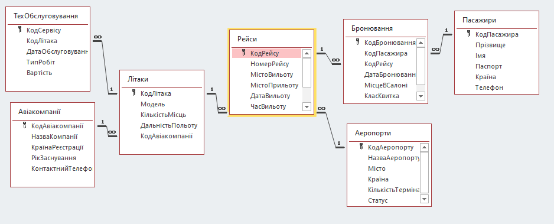

##Колекція прикладних баз даних (MS Access) 

Великий набір реляційних баз даних, розроблених для автоматизації обліку, звітності та управління даними в різних галузях бізнесу та сервісів.

###  Мета
[cite_start]Створити зручні десктопні рішення для зберігання інформації, мінімізації надмірності даних та автоматизації формування бізнес-звітів[cite: 29].

###  Інструменти та технології
* [cite_start]**СУБД:** Microsoft Access (MS Access)[cite: 30].
* **Компоненти:** Схема даних (Relationships), Форми (Forms), Запити (Queries), Звіти (Reports), Макроси.

###  Опис задачі
[cite_start]В межах цього напрямку було реалізовано понад 20 проектів[cite: 31]. Основні завдання включали:
* [cite_start]Проектування архітектури таблиць та встановлення зв'язків (один-до-багатьох, один-до-одного)[cite: 31].
* [cite_start]Розробка графічного інтерфейсу (форм) для зручного введення даних користувачем[cite: 31].
* Написання складних запитів для фільтрації та обробки великих масивів інформації.

###  Список ключових розроблених баз даних:
* **Транспорт:** Аеропорт.
* **Торгівля:** Магазин будматеріалів, Магазин автозапчастин, Зоомагазин, Магазин комп'ютерної техніки, Книжковий магазин.
* **Виробництво та послуги:** Будівельна фірма, Меблева фабрика, Рекламна агенція, Юридична фірма.
* **Медицина та освіта:** Аптека БД, Реабілітаційний центр, Школа іноземних мов.

###  Приклад структури (Схема даних)
Кожен проєкт містить нормалізовану схему даних. [cite_start]Наприклад, у базі **«Будівельна фірма»** реалізовано зв'язки між таблицями `Об'єкти`, `Працівники`, `Матеріали` та `Замовники`.

###  Результати
* [cite_start]Створено комплексну екосистему баз даних для різних бізнес-сценаріїв[cite: 33].
* Оптимізовано процес пошуку інформації за допомогою налаштованих індексів та запитів.
* Реалізовано автоматичне генерування звітів для друку (накладні, списки працівників, звіти по залишках).

###  Візуалізація

---
[cite_start]**Автор:** Михайло — Database Specialist & Developer [cite: 79-82]
